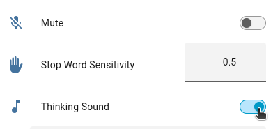

# Dashboard / Home Assistant Entities

Once your satellite is connected, Home Assistant exposes a set of controls on its device page (via the ESPHome integration) that let you change LVA's behavior at runtime, without restarting the container or editing config files. This document walks through each of those entities.

> **Go to [Settings > Devices & services](https://my.home-assistant.io/redirect/integrations/) and select the ESPHome integration.**

## Wake Word

The device page exposes one or two wake word selects (**Wake Word 1**, **Wake Word 2**), depending on whether your assistant is configured for dual wake words. Changing the selection here takes effect immediately and is persisted to `preferences.json`, so it survives restarts.

💡 **Note:** Models suffixed with **(OWW)** in the dropdown are [openWakeWord](https://github.com/dscripka/openWakeWord) models; everything else is a [microWakeWord](https://github.com/kahrendt/microWakeWord) model. Both engines can be mixed and matched, but keep in mind:

- **microWakeWord** models are lighter-weight and are the default engine bundled with LVA.
- **openWakeWord (OWW)** models are typically pulled in when you point `--wake-word-dir` (or the `WAKE_WORD_DIR` environment variable) at the `openWakeWord` subdirectory, or when downloading a custom wake word from Home Assistant that targets that engine.

See the [Wake Word section](install_application.md#wake-word) of the installation guide for the full list of bundled models and how to add custom ones.

## Mute Switch

The **Mute** switch disables wake word detection and stops the assistant from responding to any wake word or button-triggered listening, without stopping the LVA process itself. While muted, a configurable sound plays to confirm the mute/unmute transition (`--mute-sound` / `--unmute-sound`).

## Thinking Sound

The **Thinking Sound** switch toggles whether a short audible chime plays while the assistant is processing your request (between the end of listening and the start of the response). This is the same setting as the `--enable-thinking-sound` CLI flag / `ENABLE_THINKING_SOUND` environment variable, but can be flipped on or off at runtime from this switch. The change is saved to `preferences.json`.

## Media Player

The **Media Player** entity controls playback (play/pause/stop) and volume for both:

- Music/media played through the satellite, and
- The assist pipeline itself (wake word chime, TTS responses, thinking/processing sound, etc.)

Both share a single volume control — there is no separate volume for the pipeline versus music playback. Adjusting the volume slider on this entity changes both at once, and the value is persisted to `preferences.json` so it's restored on the next startup.

## Sensitivity and Microphone Settings

Wake word/stop word sensitivity, microphone gain, and noise suppression are also exposed as dashboard entities on the device page. These are covered in detail, including tuning guidance, in [Audio Options](audio_options.md).

## Support

If a dashboard control doesn't behave as expected, enable `--debug` (or `ENABLE_DEBUG=1`) and check the logs — every change made from the Home Assistant device page is logged when it's received and persisted.
